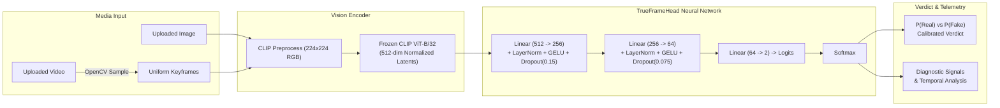

# TrueFrame AI 🛡️

> **Multimodal Deepfake & AI-Generated Media Detection System**  
> Calibrated, high-precision forensic analysis for authentic vs. synthetic human faces in images and video streams.

[](https://fastapi.tiangolo.com)
[](https://pytorch.org)
[](https://github.com/openai/CLIP)
[](https://reactjs.org)
[](https://vitejs.dev)
[](https://clerk.com)
[](https://www.mongodb.com/atlas)
[](LICENSE)

---

## 📌 Overview

**TrueFrame AI** is an end-to-end deep learning and web forensic platform designed to expose visual manipulation, deepfakes, and AI-synthesized faces created by generative pipelines such as StyleGAN (1/2/3), Latent Diffusion, Stable Diffusion, and Midjourney.

By combining the rich semantic representations of OpenAI's frozen **CLIP ViT-B/32** vision encoder with a fine-tuned deep classification head and temporal keyframe sampling, TrueFrame delivers calibrated probabilistic verdicts, per-signal forensic telemetry, and interactive frame inspection within milliseconds.

---

## ✨ Key Features

- **🖼️ Deepfake Image Inspection**:
  - Instant drag-and-drop face analysis.
  - Generates real vs. synthetic probabilities with high precision.
  - Multi-signal forensic breakdown:
    - **Boundary Consistency**: Checks for warp edges and blending seams.
    - **Frequency Distribution**: Detects high-frequency spectral artifacts typical of generative upsamplers.
    - **Semantic Coherence**: Analyzes anatomical irregularities in eyes, ears, and facial symmetry.
  - Sub-50ms inference latency on GPU / accelerated CPU.

- **🎥 Video Manipulation & Keyframe Analyzer**:
  - Temporal keyframe sampling via OpenCV (`cv2.VideoCapture`).
  - Evaluates uniform timeline intervals to identify sporadic frame-swaps and temporal flickering.
  - Frame-by-frame confidence scrubber highlighting the most anomalous frames.

- **🌀 Interactive 3D Face Spiral**:
  - Custom CSS 3D cylindrical spiral showcasing synthetic vs. authentic face distributions.
  - Smooth inertia dragging, hover-pause, and interactive previews.

- **🔐 Enterprise Authentication**:
  - Integrated Clerk authentication supporting passwordless login, social providers, and session tokens.
  - Asymmetric JWT verification on FastAPI using Clerk's JWKS public keys.

- **🗄️ Cloud Auditing & Persistent History**:
  - MongoDB Atlas integration for storing inspection records, verdict distributions, and timestamps.
  - Zero-downtime resilience: automatically falls back to an in-memory local history cache if database credentials are not configured.

- **🎨 Modern Forensic Interface**:
  - High-contrast, dark-mode design engineered for rapid analysis.
  - Built with React 18, Vite, Lucide icons, and optimized CSS tokens.

---

## 🧠 Model Architecture & Methodology



### Classification Head Specifications (`TrueFrameHead`)
| Layer | Input Dimension | Output Dimension | Activation / Regularization |
| :--- | :--- | :--- | :--- |
| **Encoder Input** | `512` | `512` | L2 Vector Normalization |
| **Dense Block 1** | `512` | `256` | `LayerNorm` + `GELU` + `Dropout(p=0.15)` |
| **Dense Block 2** | `256` | `64` | `LayerNorm` + `GELU` + `Dropout(p=0.075)` |
| **Output Layer** | `64` | `2` | Linear Logits (`real`, `fake`) |

---

## 📁 Repository Structure

```
trueframe-project/
├── frontend/                     # React 18 + Vite frontend
│   ├── public/                   # Static assets and face spiral samples
│   ├── src/
│   │   ├── components/           # Navbar, InfiniteSpiral, UploadDropzone, VerdictBadge
│   │   ├── pages/                # Home, ImageCheck, VideoCheck, History, Login
│   │   ├── AuthContext.jsx       # Clerk authentication wrapper & token management
│   │   ├── App.jsx               # Client routes & layout
│   │   └── index.css             # Theme variables, 3D transform utilities & styles
│   ├── .env.example              # Frontend environment template
│   ├── package.json
│   └── vite.config.js            # Vite config with API proxy to :8000
│
├── trueframe-backend/            # FastAPI Python backend
│   ├── backend/
│   │   ├── ml/
│   │   │   ├── model_def.py      # PyTorch TrueFrameHead architecture definition
│   │   │   ├── inference.py      # Engine loading CLIP ViT-B/32 + classifier weights
│   │   │   └── preprocess.py     # Image byte decoders and transforms
│   │   ├── models/
│   │   │   └── v2_classifier_head.pt  # Trained model weights checkpoint
│   │   ├── routers/
│   │   │   ├── predict.py        # /api/predict/image & /api/predict/video
│   │   │   ├── auth.py           # /api/auth/me with Clerk JWKS verification
│   │   │   └── history.py        # /api/history retrieval & clearing
│   │   ├── config.py             # App configurations & environment parsing
│   │   ├── db.py                 # MongoDB Atlas client connection & fallbacks
│   │   ├── history_store.py      # Inspection record schema & memory store
│   │   ├── main.py               # FastAPI initialization & CORS
│   │   └── requirements.txt      # Python dependencies
│   ├── .env.example              # Backend environment template
│   └── README.md                 # Dedicated backend documentation
│
└── README.md                     # Root project documentation
```

---

## 🚀 Quick Start Guide

### 1. Clone the Repository
```bash
git clone https://github.com/Srinivas-Manchinasetti/TrueFrame-Ai.git
cd TrueFrame-Ai
```

---

### 2. Backend Setup

1. **Navigate to the backend directory and create a virtual environment:**
   ```bash
   cd trueframe-backend
   python -m venv venv
   ```

2. **Activate the virtual environment:**
   - **Windows:**
     ```powershell
     .\venv\Scripts\Activate.ps1
     ```
   - **macOS / Linux:**
     ```bash
     source venv/bin/activate
     ```

3. **Install dependencies:**
   ```bash
   pip install -r backend/requirements.txt
   ```

4. **Verify Model Weights:**
   Ensure the trained classifier weights file `v2_classifier_head.pt` is present in:
   ```
   trueframe-backend/backend/models/v2_classifier_head.pt
   ```

5. **Configure Environment Variables:**
   Copy `.env.example` to `.env` inside `trueframe-backend/backend/.env`:
   ```bash
   cp .env.example backend/.env
   ```
   Edit `backend/.env` with your credentials:
   ```ini
   # Optional: MongoDB Atlas connection (runs in-memory fallback if left blank)
   MONGODB_URI=mongodb+srv://<username>:<password>@cluster0.xxxxx.mongodb.net/?retryWrites=true&w=majority&appName=TrueFrameAI
   MONGODB_DB_NAME=trueframe

   # Inference device ("cpu" or "cuda")
   TRUEFRAME_DEVICE=cpu

   # Optional: Clerk Secret Key for authenticated route verification
   CLERK_SECRET_KEY=your_clerk_secret_key_here
   ```

6. **Start the FastAPI Server:**
   ```bash
   uvicorn backend.main:app --reload --port 8000
   ```
   The backend API will run at `http://localhost:8000`. Swagger documentation is available at `http://localhost:8000/docs`.

---

### 3. Frontend Setup

1. **Open a new terminal and navigate to the `frontend/` directory:**
   ```bash
   cd frontend
   ```

2. **Install Node dependencies:**
   ```bash
   npm install
   ```

3. **Configure Environment Variables:**
   Copy `.env.example` to `.env`:
   ```bash
   cp .env.example .env
   ```
   Add your Clerk Publishable Key:
   ```ini
   VITE_CLERK_PUBLISHABLE_KEY=your_clerk_publishable_key_here
   ```

4. **Launch the development server:**
   ```bash
   npm run dev
   ```
   Open your browser at `http://localhost:5173`.

---

## 📡 REST API Reference

| Method | Endpoint | Description | Auth Required |
| :--- | :--- | :--- | :---: |
| `GET` | `/health` | Server status, inference device, and DB connection | No |
| `POST` | `/api/predict/image` | Analyzes an uploaded image for synthetic facial cues | Optional |
| `POST` | `/api/predict/video` | Samples keyframes and detects temporal deepfake artifacts | Optional |
| `GET` | `/api/history` | Fetches recent inspection records | Optional |
| `DELETE` | `/api/history` | Clears recent inspection records | Optional |
| `GET` | `/api/auth/me` | Validates session token and returns current user info | Yes |

### Sample Response: `POST /api/predict/image`
```json
{
  "filename": "sample_face.jpg",
  "verdict": "fake",
  "confidence": 0.968,
  "p_real": 0.032,
  "p_fake": 0.968,
  "real_prob": 3.2,
  "fake_prob": 96.8,
  "inference_time_ms": 28,
  "summary": "Generative synthesis artifacts detected with 96.8% confidence. Boundary frequency variance indicates AI origin.",
  "signals": {
    "boundary_consistency": 12.9,
    "frequency_distribution": 17.7,
    "semantic_coherence": 22.6
  }
}
```

---

## 🛠️ Technology Stack

- **Deep Learning & Computer Vision**: PyTorch, OpenAI CLIP (ViT-B/32), OpenCV, Pillow
- **API Framework**: FastAPI, Uvicorn, Python-Multipart
- **Authentication**: Clerk React SDK, PyJWT, Cryptography, JWKS Verification
- **Database & Storage**: MongoDB Atlas, PyMongo, In-Memory Thread-Safe Cache
- **Frontend Architecture**: React 18, React Router v6, Vite, Lucide React
- **Design System**: Vanilla CSS Design Tokens, 3D CSS Transforms, Responsive Flex/Grid Layouts

---

## 🛡️ Responsible Use & Ethics

TrueFrame AI is developed for forensic research, media literacy, verification of digital content, and defense against malicious impersonation. Machine learning models produce probabilistic estimations; critical verifications should be corroborated with additional cryptographic provenance (e.g., C2PA metadata) and forensic indicators.

---

## 📄 License

This project is licensed under the **MIT License**. See the [LICENSE](LICENSE) file for more details.
